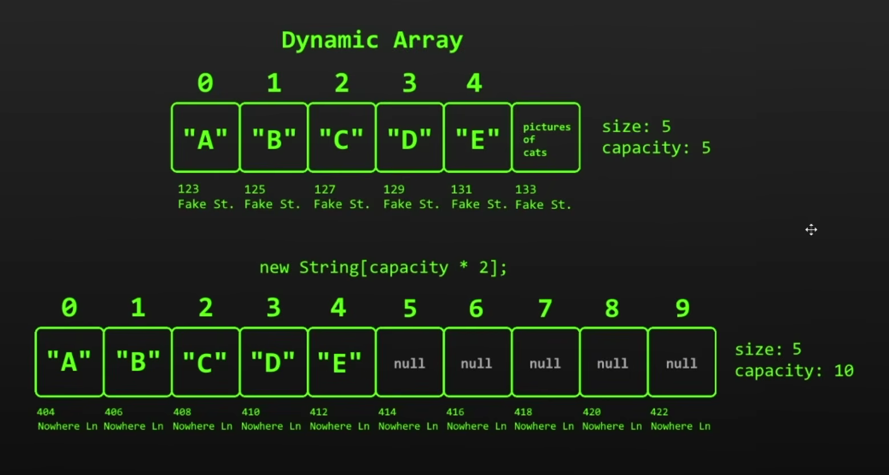

## Dynamic Array - Arreglos Dinámicos

Un Arreglo Dinámico es un array que permite ajustar su capacidad en tiempo de ejecución.
Si necesitamos más espacios para insertar elementos, podemos incrementar su capacidad 

En los arreglos normales, la capacidad que se define en tiempo de compilación se queda fija
y ya no puedes ser cambiada. 

La clase que representa un Arreglo Dinámico en Java es `ArrayList` 

En Java, los ArrayList ocupan internamente un arreglo estático de capacidad fija. Una vez
este arreglo interno alcanza su capacidad, el ArrayList instancia un nuevo arreglo estático
con la capacidad incrementada, copiando los elementos del arreglo anterior al nuevo.

 

### Ventajas
 - Acceso aleatorio a elementos de forma eficiente (O(1))
 - Uso para cache de datos
 - Eficiente a la hora de insertar y eliminar elementos al final (no hace falta desplazar elementos)

### Desventajas
 - Tiende a desperdiciar más memoria (posiblemente no todos los espacios se ocupen)
 - Desplazamiento de elementos tiene una complejidad O(n) (lineal), mientras más cerca del índice 0
   querramos insertar o eliminar un elemento, más desplazamientos se deben realizar.
 - Incrementar o disminuir la capacidad del arreglo tiene una complejidad O(n), ya que necesitamos
   copiar los elementos del arreglo anterior.
