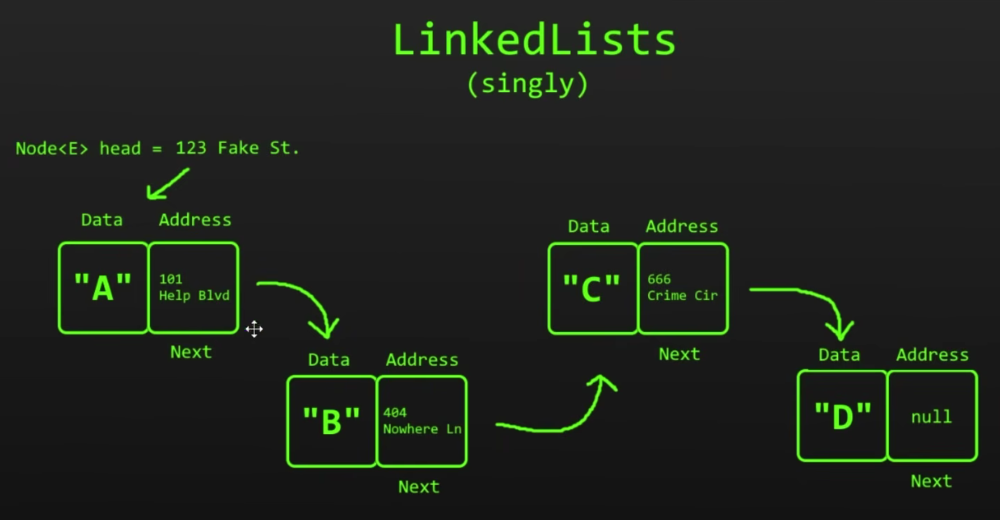
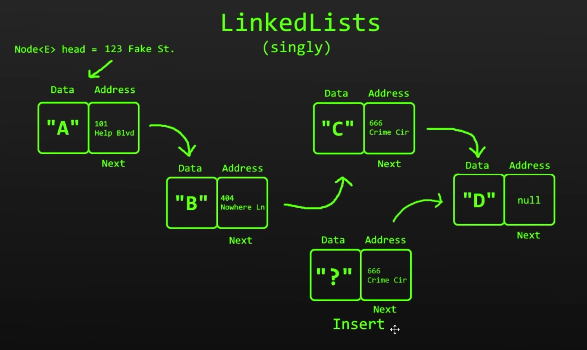
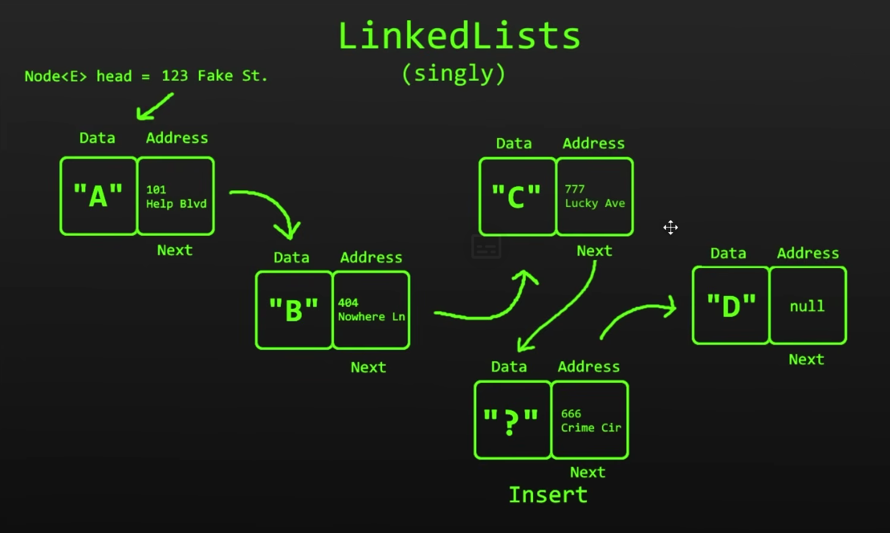
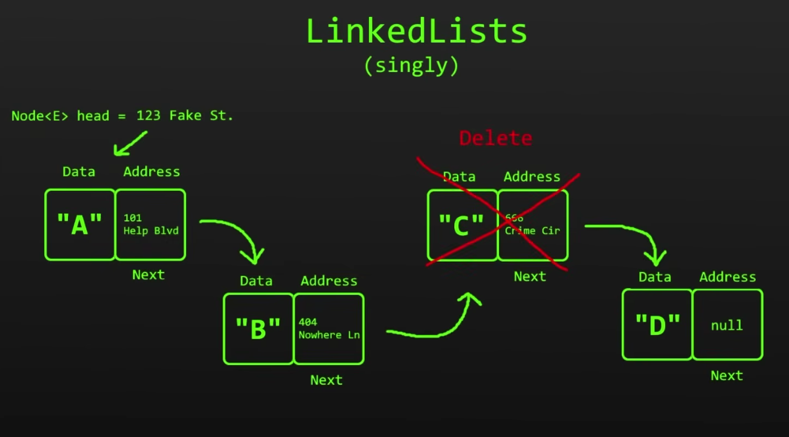
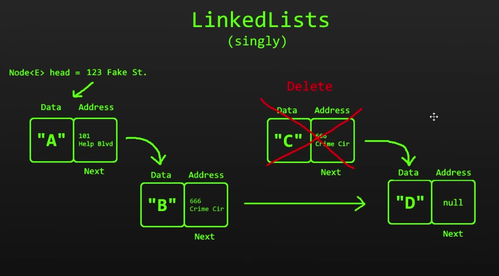
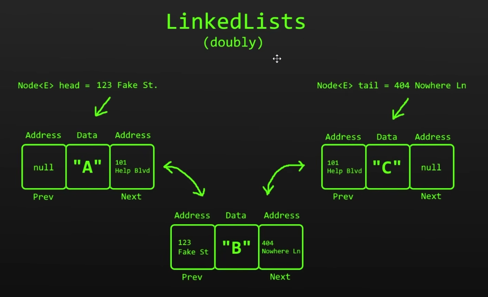

## Listas Enlazadas / Linked Lists

Una **Lista Enlazada** es una estructura de datos lineal que está compuesta por una cadena de Nodos.

Cada Nodo contiene dos partes:
   - Un objeto o dato que necesitamos almacenar
   - Un puntero o referencia hacía el siguiente Nodo en la lista

 

A diferencia de los Arrays o Listas, que almacenan los elementos en memoria contigua (uno seguido del otro), los elementos
o Nodos de las listas enlazadas pueden estar en direcciones completamente aleatorias y separadas entre sí.

Cada Nodo conoce la dirección del siguiente Nodo, de esta forma es posible recorrer por cada uno de los Nodos en la Lista
hasta llegar al último (Tail/Cola), el cual tiene un valor **null** como puntero; no apunta a ningún Nodo más.
 

 

Las Listas Enlazadas tienen ventaja con los arrays a la hora de insertar y eliminar elementos. Mientras que en
los arrays es necesario desplazar los elementos que están a la derecha de la posición del elemento a insertar o eliminar,
en las Listas Enlazadas solo se modifican los punteros de los Nodos previo y siguiente al Nodo a insertar/eliminar.

### Insertar un nuevo Nodo en una Lista Enlazada

***Se toma el puntero del Nodo previo y se asigna como puntero del nuevo Nodo, ahora el nuevo Nodo apunta al siguiente Nodo en la lista***

***Se actualiza el puntero del Nodo previo con la dirección del nuevo Nodo insertado***

Y eso es todo, de esa forma podemos insertar un nuevo Nodo en cualquier posición de la cadena. No hace falta desplazar el
resto de Nodos como en los arrays.

### Eliminar un Nodo en una Lista Enlazada

***Eliminar un Nodo también es muy fácil. Se toma el puntero del Nodo a eliminar y se asigna como puntero del Nodo previo.***
***Ahora el Nodo previo apunta al Nodo que se ecuentra inmediatamente después del Nodo eliminado***

 

Como acabamos de ver, las Listas Enlazadas son más eficientes que los arrays en operaciones de inserción y borrado
de elementos. Sin embargo, cuando se trata de realizar búsquedas, los arrays son bastante superiores a las Listas Enlazadas.
Debido a la naturaleza de los arrays de ser estructuras indexadas, podemos acceder a cualquiera de sus elementos de forma
aleatoria. Esto no pasa con las Listas Enlazadas, para ubicar un elemento tenemos que recorrer desde el primer Nodo (Head)
hacía el último (Tail), hasta encontrar el elemento que estamos buscando.

### Listas Doblemente Enlazadas / Doubly Linked Lists

Existen dos variantes de Listas Enlazadas, Listas Enlazadas Simples (Linked List o Singly Linked List) y Listas Doblemente Enlazadas
(Doubly Linked List).
La diferencia principal, es que en una Lista Doblemente Enlazada, cada Nodo tiene ***dos punteros***, uno apuntando al Nodo
previo y otro que referencía la Nodo siguiente. Mientras que en una Lista Enlazada Simple, como estuvimos viendo, cada Nodo
tiene un solo puntero, el cual referencia al Nodo siguiente en la cadena.

La ventaja de las Listas Doblemente Enlazadas, es que se pueden recorrer desde el Nodo Head hasta el Nodo Tail, y también de
forma inversa, desde el Tail hasta el Head, ya que cada Nodo conoce la ubicación del Nodo siguiente y del previo.

La desventaja es que necesita más memoría para poder almacenar los dos punteros en cada Nodo.
